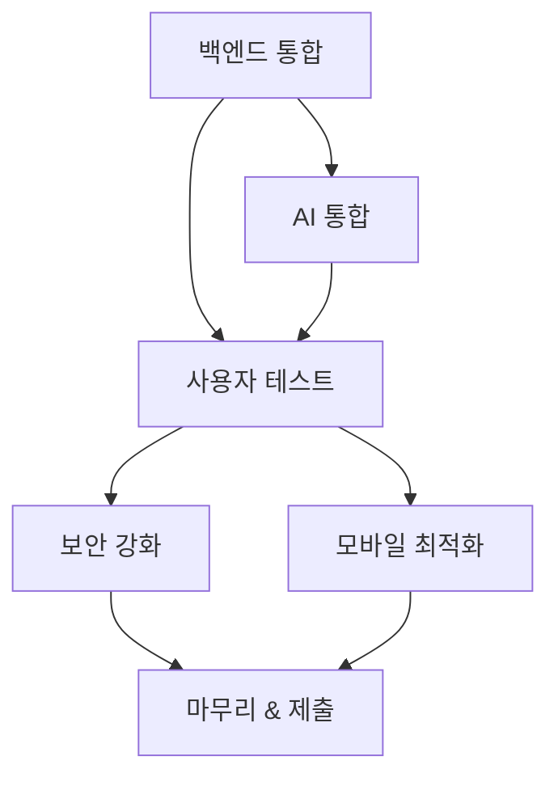

# SafeLife 플랫폼 개발 로드맵

> **AI 라이프 솔루션 챌린지 2025** 제출 대비 12개월 실행 계획
>
> 시작일: 2025년 1월
> 마감일: 2025년 12월 2일 17:00
> 목표: 우승 가능한 완전한 제품 완성

---

## 📅 타임라인 개요

```
1-2월: 백엔드 & 인증
3-4월: AI 통합
5-6월: 사용자 테스트
7-8월: 보안 & 프라이버시
9-10월: 모바일 최적화
11-12월: 마무리 & 제출
```

---

## 1-2월: 백엔드 통합 및 인증 시스템 🔧

### 목표
프론트엔드를 PocketBase 백엔드에 연결하고 완전한 인증 시스템 구축

### Week 1-2: PocketBase 통합
- [ ] **lib/pocketbase.ts 연결**
  - 모든 페이지에서 PocketBase 클라이언트 사용
  - 환경 변수 설정 확인
  - 연결 테스트 작성
  - 예상 시간: 3일

- [ ] **바코드 리더 DB 연동**
  - `products` 컬렉션에서 제품 조회
  - `scan_history` 저장
  - 모의 데이터 제거
  - 예상 시간: 2일

- [ ] **보이스피싱 DB 연동**
  - `voice_phishing_logs` 저장
  - `guardian_notifications` 생성
  - 실시간 구독 설정
  - 예상 시간: 2일

### Week 3-4: 인증 시스템
- [ ] **PocketBase Auth 구현**
  - 회원가입 기능 완성
  - 로그인/로그아웃 구현
  - 세션 관리
  - 예상 시간: 3일

- [ ] **역할 기반 접근 제어**
  - 고령자 vs 보호자 역할
  - 보호된 라우트 추가
  - 권한 검사
  - 예상 시간: 2일

- [ ] **보호자-고령자 연결**
  - 가족 관계 설정 UI
  - 초대 시스템
  - 관계 관리
  - 예상 시간: 3일

### Week 5-6: 키오스크 & 대시보드 DB 연동
- [ ] **키오스크 세션 저장**
  - `kiosk_sessions` 저장
  - 스크린샷 업로드
  - 세션 이력 조회
  - 예상 시간: 2일

- [ ] **보호자 대시보드 실시간 데이터**
  - PocketBase 실시간 구독
  - 알림 푸시
  - 활동 통계 계산
  - 예상 시간: 3일

- [ ] **비상 연락처 관리**
  - CRUD 기능 구현
  - 우선순위 설정
  - 빠른 다이얼 통합
  - 예상 시간: 2일

### Week 7-8: 테스트 및 디버깅
- [ ] **통합 테스트**
  - 모든 DB 작업 테스트
  - 인증 플로우 테스트
  - 에러 처리 검증
  - 예상 시간: 4일

- [ ] **성능 최적화**
  - 쿼리 최적화
  - 인덱스 추가
  - 캐싱 전략
  - 예상 시간: 2일

### 마일스톤 1 체크포인트 ✅
- [ ] 모든 기능이 실제 DB에 연결됨
- [ ] 로그인/회원가입 작동
- [ ] 고령자-보호자 관계 설정 가능
- [ ] 모의 데이터 완전 제거

---

## 3-4월: 실제 AI/ML 통합 🤖

### 목표
단순 패턴 매칭을 실제 AI 모델로 교체

### Week 9-10: 제품 데이터베이스 구축
- [ ] **식약처 API 연동**
  - API 키 발급
  - 제품 검색 API 구현
  - 응답 파싱 및 저장
  - 예상 시간: 3일

- [ ] **제품 데이터 캐싱**
  - PocketBase에 제품 저장
  - 중복 API 호출 방지
  - 주기적 업데이트 스케줄
  - 예상 시간: 2일

- [ ] **수동 제품 추가**
  - 일반 제품 100개 수동 입력
  - 알레르기 정보 포함
  - 이미지 추가
  - 예상 시간: 3일

### Week 11-13: Google Cloud Vision 통합 (키오스크)
- [ ] **API 설정**
  - GCP 프로젝트 생성
  - Vision API 활성화
  - 인증 설정
  - 예상 시간: 1일

- [ ] **OCR 구현**
  - 화면 캡처 전송
  - 텍스트 추출
  - 버튼 위치 감지
  - 예상 시간: 4일

- [ ] **키오스크 유형별 모델**
  - 맥도날드 키오스크 학습
  - 스타벅스 키오스크 학습
  - 범용 패턴 추출
  - 예상 시간: 5일

- [ ] **탐색 로직**
  - 의사결정 트리 구축
  - 단계별 안내 생성
  - 오류 처리
  - 예상 시간: 4일

### Week 14-16: OpenAI GPT-4 통합 (보이스피싱)
- [ ] **API 설정**
  - OpenAI API 키 발급
  - 요금제 설정
  - 사용량 모니터링
  - 예상 시간: 1일

- [ ] **프롬프트 엔지니어링**
  - 사기 감지 프롬프트 작성
  - Few-shot 예시 준비
  - 컨텍스트 윈도우 최적화
  - 예상 시간: 3일

- [ ] **하이브리드 시스템**
  - 키워드 매칭 + GPT-4 분석
  - 빠른 키워드 스크리닝
  - 의심 통화만 GPT-4 전송
  - 예상 시간: 3일

- [ ] **톤 분석 추가**
  - Web Audio API 활용
  - 피치 분석
  - 긴급성 감지
  - 예상 시간: 4일

- [ ] **사기 패턴 학습**
  - 실제 사기 사례 수집
  - 패턴 데이터베이스 구축
  - 주기적 업데이트
  - 예상 시간: 3일

### 마일스톤 2 체크포인트 ✅
- [ ] 바코드 스캐너가 100개 이상 제품 인식
- [ ] 키오스크 도우미가 실제 화면 분석
- [ ] 보이스피싱 감지가 컨텍스트 이해
- [ ] AI 비용 월 예산 내 유지

---

## 5-6월: 사용자 테스트 및 검증 👥

### 목표
실제 고령자 사용자 10명 이상 테스트, 피드백 기반 개선

### Week 17-18: 테스트 준비
- [ ] **테스트 계획 수립**
  - 테스트 시나리오 작성
  - 평가 지표 정의
  - IRB 승인 (필요시)
  - 예상 시간: 2일

- [ ] **참가자 모집**
  - 60세 이상 10명
  - 다양한 디지털 문해력 수준
  - 동의서 준비
  - 예상 시간: 1주

- [ ] **테스트 환경 구축**
  - 테스트용 기기 준비
  - 녹화 장비 설정
  - 모의 키오스크 준비
  - 예상 시간: 2일

### Week 19-20: 1차 테스트
- [ ] **바코드 리더 테스트**
  - 10명 각 5개 제품 스캔
  - 스캔 시간 측정
  - 오류율 기록
  - 만족도 설문
  - 예상 시간: 3일

- [ ] **키오스크 도우미 테스트**
  - 실제 키오스크에서 사용
  - 주문 성공률 측정
  - 도움 요청 횟수
  - 비교 실험 (도우미 있음 vs 없음)
  - 예상 시간: 3일

- [ ] **보이스피싱 테스트**
  - 모의 사기 전화 시나리오
  - 감지율 측정
  - 오탐률 확인
  - 사용자 신뢰도 평가
  - 예상 시간: 2일

### Week 21-22: 피드백 분석 및 개선
- [ ] **데이터 분석**
  - 정량적 데이터 통계 분석
  - 정성적 피드백 테마 분석
  - 개선 우선순위 결정
  - 예상 시간: 3일

- [ ] **UI/UX 개선**
  - 버튼 크기 조정
  - 음성 속도 조절
  - 색상 대비 개선
  - 예상 시간: 3일

- [ ] **기능 개선**
  - AI 정확도 향상
  - 오류 처리 강화
  - 피드백 메시지 개선
  - 예상 시간: 4일

### Week 23-24: 2차 테스트
- [ ] **개선 버전 재테스트**
  - 동일 참가자로 재테스트
  - 개선 효과 측정
  - 추가 피드백 수집
  - 예상 시간: 3일

- [ ] **증언 영상 촬영**
  - 사용자 인터뷰
  - 전후 비교 영상
  - 감동적인 스토리 수집
  - 예상 시간: 2일

- [ ] **사례 연구 작성**
  - Before/After 데이터
  - 성공 스토리
  - 통계적 유의성 검증
  - 예상 시간: 3일

### 마일스톤 3 체크포인트 ✅
- [ ] 10명 이상 고령자 테스트 완료
- [ ] 측정 가능한 개선 데이터 확보
- [ ] 사용자 증언 영상 확보
- [ ] 사례 연구 문서 완성

---

## 7-8월: 보안 및 프라이버시 강화 🔒

### 목표
데이터 보호, GDPR 준수, 윤리적 AI 구현

### Week 25-26: 데이터 보호
- [ ] **HTTPS 강제**
  - SSL/TLS 인증서 설정
  - HTTP → HTTPS 리다이렉트
  - 혼합 콘텐츠 제거
  - 예상 시간: 2일

- [ ] **데이터 암호화**
  - 민감한 필드 암호화
  - 전송 중 암호화
  - 저장 시 암호화
  - 예상 시간: 3일

- [ ] **입력 유효성 검사**
  - XSS 방지
  - SQL 인젝션 방지
  - CSRF 토큰
  - 예상 시간: 3일

### Week 27-28: 프라이버시 정책
- [ ] **동의 시스템**
  - 명시적 동의 UI
  - 선택적 기능 동의
  - 쉬운 철회 메커니즘
  - 예상 시간: 3일

- [ ] **데이터 최소화**
  - 불필요한 데이터 수집 제거
  - 전사 대신 패턴만 저장
  - 자동 삭제 정책 (30일)
  - 예상 시간: 3일

- [ ] **프라이버시 대시보드**
  - 사용자 데이터 조회
  - 데이터 다운로드 (GDPR)
  - 데이터 삭제 요청
  - 예상 시간: 4일

### Week 29-30: 투명성 및 제어
- [ ] **고령자용 프라이버시 설명**
  - 쉬운 언어로 설명
  - 시각적 가이드
  - 음성 안내
  - 예상 시간: 2일

- [ ] **보호자 모니터링 투명성**
  - 고령자가 보호자가 보는 것을 볼 수 있음
  - 접근 로그
  - 프라이버시 설정
  - 예상 시간: 3일

- [ ] **익명 모드**
  - 보호자 모니터링 없이 사용
  - 로컬 전용 데이터
  - 명확한 모드 표시
  - 예상 시간: 3일

### Week 31-32: 보안 감사
- [ ] **취약점 스캔**
  - OWASP ZAP 실행
  - npm audit 수정
  - 의존성 업데이트
  - 예상 시간: 2일

- [ ] **침투 테스트**
  - 인증 우회 시도
  - API 남용 테스트
  - 데이터 유출 확인
  - 예상 시간: 3일

- [ ] **보안 문서 작성**
  - 보안 아키텍처 다이어그램
  - 위협 모델
  - 대응 계획
  - 예상 시간: 3일

### 마일스톤 4 체크포인트 ✅
- [ ] 모든 데이터 암호화됨
- [ ] GDPR 동의 시스템 구현
- [ ] 프라이버시 정책 문서 완성
- [ ] 보안 감사 통과

---

## 9-10월: 모바일 최적화 및 PWA 📱

### 목표
고령자의 주 사용 환경인 모바일에서 완벽한 경험 제공

### Week 33-34: 모바일 UI 개선
- [ ] **터치 타겟 최적화**
  - 모든 버튼 최소 44px
  - 적절한 간격
  - 큰 입력 필드
  - 예상 시간: 2일

- [ ] **작은 화면 레이아웃**
  - 단일 열 레이아웃
  - 스크롤 최소화
  - 중요 정보 상단 배치
  - 예상 시간: 3일

- [ ] **제스처 지원**
  - 스와이프 탐색
  - 핀치 투 줌
  - 탭 vs 롱 프레스
  - 예상 시간: 3일

### Week 35-36: PWA 구현
- [ ] **웹 매니페스트**
  - 앱 아이콘
  - 스플래시 화면
  - 테마 색상
  - 예상 시간: 1일

- [ ] **서비스 워커**
  - 오프라인 지원
  - 백그라운드 동기화
  - 푸시 알림 준비
  - 예상 시간: 4일

- [ ] **설치 프롬프트**
  - 앱 추가 안내
  - 설치 이점 설명
  - 쉬운 설치 프로세스
  - 예상 시간: 2일

- [ ] **오프라인 기능**
  - 바코드 스캔 오프라인
  - 로컬 데이터베이스 (IndexedDB)
  - 온라인 복귀 시 동기화
  - 예상 시간: 5일

### Week 37-38: 기기별 테스트
- [ ] **iOS 테스트**
  - iPhone 8+ (고령자 많이 사용)
  - Safari 호환성
  - 홈 화면 추가
  - 예상 시간: 3일

- [ ] **Android 테스트**
  - Galaxy S21 이하
  - Chrome 호환성
  - 다양한 화면 크기
  - 예상 시간: 3일

- [ ] **태블릿 최적화**
  - iPad (10인치)
  - 중간 레이아웃
  - 가로 모드 지원
  - 예상 시간: 2일

### Week 39-40: 성능 최적화
- [ ] **로딩 속도**
  - 코드 분할
  - 이미지 최적화
  - 지연 로딩
  - 목표: Lighthouse 90+
  - 예상 시간: 3일

- [ ] **배터리 효율**
  - 백그라운드 작업 최소화
  - 효율적인 폴링
  - Wake Lock API
  - 예상 시간: 2일

- [ ] **네트워크 최적화**
  - 요청 최소화
  - 캐싱 전략
  - 낮은 대역폭 지원
  - 예상 시간: 3일

### 마일스톤 5 체크포인트 ✅
- [ ] PWA로 설치 가능
- [ ] 오프라인 모드 작동
- [ ] iOS/Android 테스트 통과
- [ ] Lighthouse 점수 90+

---

## 11-12월: 마무리 및 공모전 제출 준비 🎬

### 목표
데모 영상, 문서, 최종 마무리 및 제출

### Week 41-42: 데모 영상 제작
- [ ] **시나리오 작성**
  - 3-5분 스토리보드
  - 감동적인 오프닝
  - 기능별 데모
  - 임팩트 엔딩
  - 예상 시간: 2일

- [ ] **촬영**
  - 실제 고령자 출연
  - 보호자 인터뷰
  - B-roll 영상
  - 예상 시간: 3일

- [ ] **편집**
  - 자막 (한국어/영어)
  - 배경 음악
  - 효과 및 전환
  - 예상 시간: 3일

- [ ] **리뷰 및 수정**
  - 내부 리뷰
  - 외부 피드백
  - 최종 수정
  - 예상 시간: 2일

### Week 43-44: 문서 완성
- [ ] **기술 문서**
  - API 문서
  - 아키텍처 다이어그램
  - 배포 가이드
  - 예상 시간: 3일

- [ ] **사용자 가이드**
  - 고령자용 매뉴얼
  - 보호자용 가이드
  - FAQ
  - 예상 시간: 3일

- [ ] **공모전 제출 문서**
  - 프로젝트 설명서
  - 사회적 임팩트 보고서
  - 기술 혁신 설명
  - 예상 시간: 4일

### Week 45-46: 최종 점검 및 버그 수정
- [ ] **종합 테스트**
  - 모든 기능 재테스트
  - 엣지 케이스 확인
  - 크로스 브라우저 테스트
  - 예상 시간: 4일

- [ ] **버그 수정**
  - 치명적 버그 우선
  - UI 미세 조정
  - 성능 병목 해결
  - 예상 시간: 4일

- [ ] **코드 정리**
  - 불필요한 코드 제거
  - 주석 추가
  - 린트 오류 수정
  - 예상 시간: 2일

### Week 47-48: 제출 준비
- [ ] **제출 패키지 준비**
  - 소스 코드 정리
  - README 최종 업데이트
  - 라이선스 확인
  - 예상 시간: 2일

- [ ] **데모 환경 준비**
  - 프로덕션 배포 확인
  - 백업 서버 준비
  - 오프라인 데모 준비
  - 예상 시간: 2일

- [ ] **발표 준비** (필요시)
  - 프레젠테이션 슬라이드
  - 발표 연습
  - Q&A 준비
  - 예상 시간: 3일

### Week 49 (12월 1-2일): 제출
- [ ] **최종 체크리스트**
  - 모든 필수 문서 확인
  - 데모 영상 업로드
  - 링크 작동 확인
  - 예상 시간: 1일

- [ ] **제출**
  - 제출 시스템에 업로드
  - 제출 확인 메일 확인
  - 백업 제출
  - **마감: 2025년 12월 2일 17:00**

### 마일스톤 6 (최종) 체크포인트 ✅
- [ ] 데모 영상 완성 (3-5분)
- [ ] 모든 문서 완성
- [ ] 버그 제로
- [ ] 제출 완료!

---

## 위험 요소 및 대응 방안 ⚠️

### 기술적 위험

#### 위험 1: AI API 비용 초과
- **영향**: 높음
- **대응**:
  - 사용량 모니터링 자동화
  - 캐싱으로 API 호출 최소화
  - 무료 티어/크레딧 활용
  - 필요시 로컬 모델로 대체

#### 위험 2: 식약처 API 불안정
- **영향**: 중간
- **대응**:
  - 로컬 데이터베이스 캐싱
  - 대체 API 조사
  - 수동 데이터 입력 준비
  - 폴백 메커니즘 구현

#### 위험 3: 브라우저 호환성 문제
- **영향**: 중간
- **대응**:
  - 폴리필 사용
  - 기능 감지 및 폴백
  - 지원 브라우저 명시
  - 조기에 광범위한 테스트

### 일정적 위험

#### 위험 4: 사용자 테스트 참가자 모집 실패
- **영향**: 높음
- **대응**:
  - 조기 모집 시작 (3월부터)
  - 다양한 채널 활용 (복지관, 온라인)
  - 인센티브 제공
  - 가족/지인 동원

#### 위험 5: 일정 지연
- **영향**: 높음
- **대응**:
  - 2주 버퍼 시간 내장
  - 주간 진행 상황 체크
  - 우선순위 엄격히 준수
  - 필요시 범위 축소

### 외부 위험

#### 위험 6: 공모전 규정 변경
- **영향**: 낮음
- **대응**:
  - 공식 웹사이트 주기적 확인
  - 이메일 알림 설정
  - 규정 변경 시 즉각 대응

---

## 의존성 관계 📊



**중요**:
- 백엔드 통합 없이 AI 통합 불가
- 사용자 테스트는 백엔드와 AI가 모두 완성되어야 의미 있음
- 보안과 모바일은 병렬로 진행 가능

---

## 주간 작업 시간 예산 ⏰

- **개발**: 주 20시간
- **테스트**: 주 5시간
- **문서**: 주 3시간
- **회의/기타**: 주 2시간
- **총**: 주 30시간

**팀 구성 권장**:
- 개발자: 2명
- 디자이너: 1명 (파트타임)
- 테스터: 1명 (파트타임)
- PM: 1명 (파트타임)

---

## 성공 지표 (KPI) 📈

### 기술 지표
- [ ] 바코드 스캔 정확도 > 95%
- [ ] 키오스크 도우미 성공률 > 80%
- [ ] 보이스피싱 감지율 > 90% (오탐률 < 10%)
- [ ] 페이지 로딩 속도 < 2초
- [ ] Lighthouse 점수 > 90

### 사용자 지표
- [ ] 고령자 만족도 > 4.5/5
- [ ] 작업 완료 시간 30% 감소
- [ ] 오류율 50% 감소
- [ ] 독립적 사용 가능 비율 > 70%

### 비즈니스 지표
- [ ] 사용자 테스트 완료: 10명+
- [ ] 데모 영상 조회수: 1,000+
- [ ] GitHub 스타: 100+
- [ ] 언론 보도: 3건+

---

## 체크리스트 요약 ✅

### 필수 (Must-Have)
- [ ] PocketBase 백엔드 완전 통합
- [ ] 실제 AI 모델 (Vision API + GPT-4)
- [ ] 10명+ 고령자 테스트
- [ ] 데모 영상 (3-5분)
- [ ] 보안 및 프라이버시 구현

### 중요 (Should-Have)
- [ ] 100개+ 제품 데이터베이스
- [ ] PWA 설치 가능
- [ ] 오프라인 모드
- [ ] 푸시 알림

### 선택 (Nice-to-Have)
- [ ] 다국어 지원
- [ ] 고급 분석
- [ ] 커뮤니티 기능
- [ ] 웨어러블 통합

---

## 다음 단계 🚀

**지금 바로 시작해야 할 작업** (우선순위 순):

1. **Week 1-2**: PocketBase 연결 시작
   - lib/pocketbase.ts를 바코드 페이지에 연결
   - 환경 변수 설정
   - 첫 DB 쿼리 테스트

2. **병렬 작업**: 식약처 API 키 신청
   - 시간이 걸릴 수 있으므로 조기 신청
   - 대기 중에는 모의 데이터로 개발

3. **병렬 작업**: 사용자 테스트 참가자 모집 시작
   - 지역 복지관 연락
   - 모집 공고 작성
   - 동의서 준비

**월말 목표**:
- [ ] PocketBase 기본 연결 완료
- [ ] 바코드 리더 DB 연동 테스트
- [ ] API 키 발급 완료
- [ ] 테스트 참가자 5명 이상 확보

---

## 참고 자료 📚

- [PocketBase 문서](https://pocketbase.io/docs/)
- [식약처 오픈 API](https://www.foodsafetykorea.go.kr/api/)
- [Google Cloud Vision API](https://cloud.google.com/vision/docs)
- [OpenAI API 가이드](https://platform.openai.com/docs)
- [PWA 베스트 프랙티스](https://web.dev/progressive-web-apps/)
- [GDPR 가이드라인](https://gdpr.eu/)

---

**문서 버전**: 1.0
**마지막 업데이트**: 2025년 11월 11일
**작성자**: Claude Code (AI Assistant)
